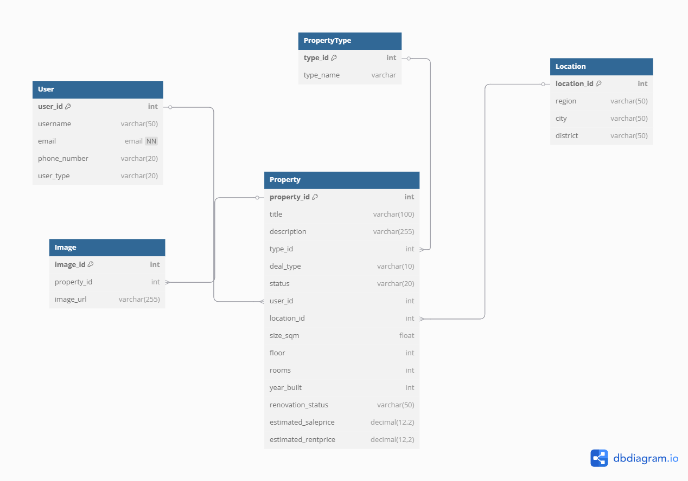

# 🏡 Predicting Real Estate Prices for Buying or Renting

**Marketing Analytics Project**  
The real estate market is volatile in Armenia, and both buyers and renters face challenges in determining the appropriate price for properties. Consumers often rely on intuition or outdated information, leading to suboptimal financial decisions. A platform that accurately predicts house prices can assist both buyers/renters and real estate investors in making informed decisions.

---

## 👥 Project Members

| Name                | Role                 |
|---------------------|----------------------|
| **David Aslanyan**  | Project Manager      |
| **Marina Melkonyan**| Data Scientist       |
| **Mikayel Mikayelyan** | Backend Engineer  |
| **Lilit Ivanyan**   | DB Developer         |
| **Marina Melkonyan**| Frontend Developer   |


## 📄 [Project Description](https://docs.google.com/document/d/11OJNRnnq2lZdgOXWndGn-yDkSRa1fx1uDCb__ijpR5E/edit?tab=t.0)
## 🌐 [UI Prototype](https://www.figma.com/design/uahdQREnaz8OS5VTAKfniV/House-price-Prediction?node-id=0-1&p=f&t=aJBnhiUe9R1Lv2zr-0)


## Installation


Before getting started, ensure you have the following prerequisites installed:

1. Clone the repository:
   ```bash
   git clone https://github.com/DS-223/Group-4
   cd myapp
   ```

2. Build and start the Docker containers:
   ```bash
   docker-compose up --build
   ```


## Project structure


Here’s an overview of the project’s file structure:
```bash

.
├── README.md
├── feedback.md
├── mkdocs.yml
├── ERD_House_Price_Final.png
├── mkdocs_requirement.txt
└── myapp/
    ├── api/
    │   ├── .env
    │   ├── Dockerfile
    │   ├── main.py
    │   ├── requirements.txt
    │   └── etl/
    │       ├── database.py
    │       └── models.py
    ├── app/
    │   ├── __init__.py
    │   ├── Dockerfile
    │   ├── app.py
    │   └── reqirements.txt
    ├── etl/
    │   ├── database/
    │   │   ├── __init__.py
    │   │   ├── data_generate.py
    │   │   ├── database.py
    │   │   └── models.py
    │   ├── data/
    │   │   └── .gitkeep
    │   │   │   ├── images.csv
    │   │   │   ├── users.csv
    │   │   │   ├── property_ml_ready.csv
    │   │   │   ├── property_types.csv
    │   │   │   ├── locations.csv
    │   │   │   └── properties.csv
    │   ├── .env
    │   ├── Dockerfile
    │   ├── __init__.py
    │   ├── etl_process.py
    │   └── requirements.txt
    ├── model/
    │   ├── models/
    │   │   ├── rent_price_model.pkl
    │   │   └── sales_price_model.pkl
    │   ├── property_predictions.csv
    │   ├── property_ml_ready.csv
    │   └── example.ipynb
    │   └── requirements.txt
    │   └── Dockerfile
    │   └── main_model.py 
    ├── .env
    └── docker-compose.yaml

```

## Prerequisites

Before running this setup, ensure Docker and Docker Compose are installed on your system.


- Docker: [Install Docker](https://docs.docker.com/get-docker/)
- Docker Compose: [Install Docker Compose](https://docs.docker.com/compose/install/)


## DB

- Access pgAdmin for PostgreSQL management: [http://localhost:5050](http://localhost:5050)
    - username: admin@admin.com 
    - password: admin
    - When running for the first time, you must create a server. Configure it as shown in the below image (Password is blurred it should be `password`.)
    ![Server Setup]

### Environment Variables

For the purpose of easy management and easy checking, the .env file is pushed to the remote repository.

## ETL 

### Schema Design

We will try to create below schema:




