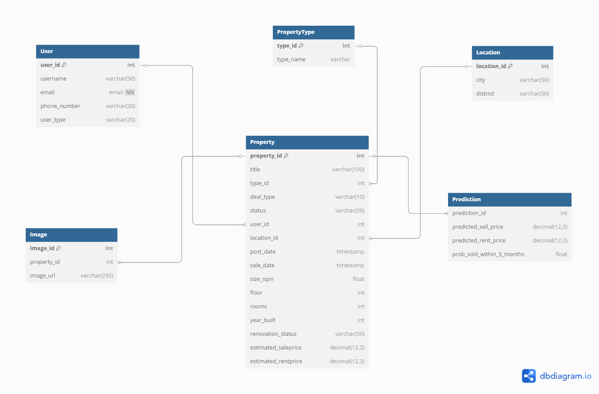

# Predicting Real Estate Prices for Buying or Renting

**Marketing Analytics Project**  
The real estate market is volatile in Armenia, and both buyers and renters face challenges in determining the appropriate price for properties. Consumers often rely on intuition or outdated information, leading to suboptimal financial decisions. A platform that accurately predicts house prices can assist both buyers/renters and real estate investors in making informed decisions.

---

## Project Members

| Name                  | Role                 |
|-----------------------|----------------------|
| **David Aslanyan**    | Project Manager      |
| **Marina Melkonyan**  | Data Scientist       |
| **Mikayel Mikayelyan**| Backend Engineer     |
| **Lilit Ivanyan**     | DB Developer         |
| **Marina Melkonyan**  | Frontend Developer   |

---

## [Project Description](https://docs.google.com/document/d/11OJNRnnq2lZdgOXWndGn-yDkSRa1fx1uDCb__ijpR5E/edit?tab=t.0)  
## [UI Prototype (Figma)](https://www.figma.com/design/uahdQREnaz8OS5VTAKfniV/House-price-Prediction?node-id=0-1&p=f&t=aJBnhiUe9R1Lv2zr-0)

---

## Installation

### Prerequisites

Ensure Docker and Docker Compose are installed on your system.

- [Install Docker](https://docs.docker.com/get-docker/)
- [Install Docker Compose](https://docs.docker.com/compose/install/)

### Steps

```bash
git clone https://github.com/DS-223/Group-4
cd myapp
docker-compose up --build
```

---

## Project Structure

```bash
.
├── README.md
├── feedback.md
├── mkdocs.yml
├── HousePrice_ERD.png
├── mkdocs_requirement.txt
└── myapp/
    ├── api/
    │   ├── Dockerfile
    │   ├── main.py
    │   ├── prediction_router.py
    │   ├── requirements.txt
    │   ├── models/
    │   │   ├── rent_price_model.pkl
    │   │   └── sell_price_model.pkl
    │   │   └── cox_model.pkl
    │   ├── database/
    │   │   ├── __init__.py
    │   │   ├── data_generate.py
    │   │   ├── database.py
    │   │   └── models.py
    ├── app/
    │   ├── __init__.py
    │   ├── Dockerfile
    │   ├── app.py
    │   └── requirements.txt
    ├── etl/
    │   ├── database/
    │   │   ├── __init__.py
    │   │   ├── data_generate.py
    │   │   ├── database.py
    │   │   └── models.py
    │   ├── data/
    │   │   ├── images.csv
    │   │   ├── users.csv
    │   │   ├── property_ml_ready.csv
    │   │   ├── property_types.csv
    │   │   ├── locations.csv
    │   │   └── properties.csv
    │   ├── .env
    │   ├── Dockerfile
    │   ├── __init__.py
    │   ├── etl_process.py
    │   └── requirements.txt
    ├── model/
    │   ├── database/
    │   │   ├── __init__.py
    │   │   ├── data_generate.py
    │   │   ├── database.py
    │   │   └── models.py
    │   ├── models/
    │   │   ├── rent_price_model.pkl
    │   │   └── sell_price_model.pkl
    │   │   └── cox_model.pkl
    │   ├── wait_for_etl.py
    │   ├── requirements.txt
    │   └── Dockerfile
    │   └── main_model.py 
    ├── .env
    └── docker-compose.yaml
```

---

## How to Use

1. Open the app at [http://localhost:8501](http://localhost:8501)
2. Enter property details like location, rooms, area, etc.
3. The system will return a predicted price and buying vs renting suggestion.

---

## Database (pgAdmin)

- Access: [http://localhost:5050](http://localhost:5050)
    - Username: `admin@admin.com`
    - Password: `admin`
- When running for the first time, create a server with:
    - Hostname: `postgres`
    - Username: `postgres`
    - Password: `password`

---

## Environment Variables

For easier deployment, the `.env` file is included in the repo:

```env
POSTGRES_DB=house_price
POSTGRES_USER=postgres
POSTGRES_PASSWORD=password
```

---

## ETL

The ETL pipeline extracts real estate datasets, cleans and transforms them, and loads them into the PostgreSQL database. This includes property data, user info, locations, and types — all standardized for model training and API use.

---

## Schema Design



The schema follows a star-like structure with `properties` at the center, and related tables like `users`, `locations`, and `types`.

---

## API & Documentation Access

- [Swagger UI](http://localhost:8000/docs)
- [MkDocs](http://localhost:8000/mkdocs) *(local deployment path)*

### Screenshots

#### Streamlit UI


---


## Useful Links

- [Project Description (Google Doc)](https://docs.google.com/document/d/11OJNRnnq2lZdgOXWndGn-yDkSRa1fx1uDCb__ijpR5E/edit?tab=t.0)
- [UI Prototype (Figma)](https://www.figma.com/design/uahdQREnaz8OS5VTAKfniV/House-price-Prediction?node-id=0-1&p=f&t=aJBnhiUe9R1Lv2zr-0)
