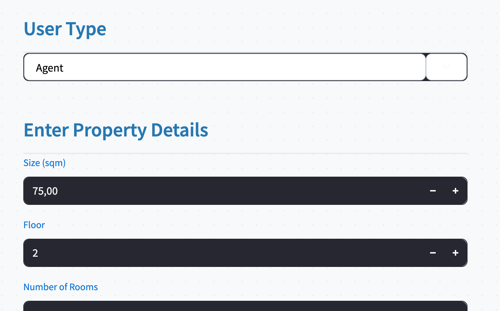

## Streamlit Application

Our frontend is built with Streamlit, providing a clean, interactive user experience for predicting real estate prices.

## Features

- Simple form to input property characteristics (e.g., size, location, rooms)
- Predictive output: estimated rent and sale prices
- Visual explanation of results and suggestions (e.g., "Buy vs Rent")
- Responsive layout for desktop and mobile
- Easy integration with the FastAPI backend

## Sample View

## Navigation Flow

1. Enter details about a property.
2. Submit the form to get predictions.
3. View predicted values and insights.
4. Repeat for comparison across property configurations.
